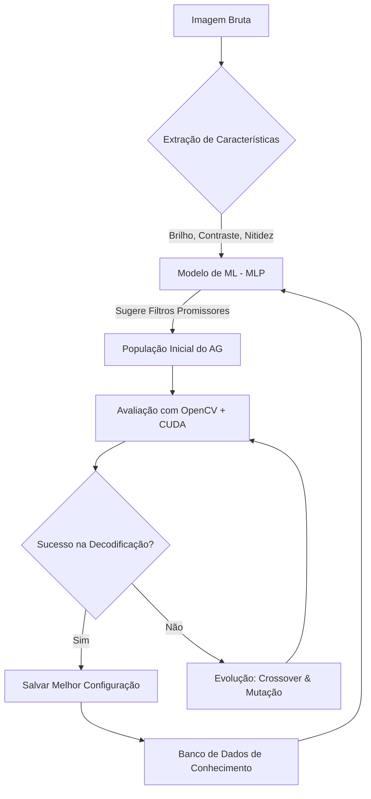

# 🚀 Otimização Inteligente de Leitura de QR Codes
## *Resolvendo a Complexidade da Visão Computacional com Algoritmos Genéticos e IA*

---

## 📋 1. O Problema: O "Ponto Cego" da Visão Computacional

A leitura de QR Codes parece simples em condições ideais, mas em cenários reais enfrenta obstáculos críticos:

*   **Iluminação Inconsistente**: Reflexos, sombras e baixa luminosidade.
*   **Ruído Digital**: Granulação em sensores de baixa qualidade.
*   **Contraste Insuficiente**: Dificuldade de distinguir os padrões do QR Code do fundo.
*   **Variabilidade de Dispositivos**: Cada câmera de celular processa cores e nitidez de forma diferente.

> [!IMPORTANT]
> **O Desafio**: Existe uma combinação infinita de filtros (brilho, contraste, nitidez, CLAHE, limiarização) e encontrar a configuração ideal para cada foto manualmente é impossível.

---

## 💡 2. A Solução: Algoritmo Genético Híbrido (HGA) com IA Preditiva

Em vez de tentar adivinhar os melhores parâmetros, desenvolvemos um sistema inteligente que combina a evolução natural com o poder preditivo das redes neurais.

### O Diferencial: Inteligência por Características de Imagem
O grande trunfo deste sistema não é apenas testar filtros, mas **entender a imagem** antes de processá-la:

1.  **Extração de Características (Features)**: Para cada imagem, o sistema extrai métricas físicas reais, como nível de brilho, contraste global, variância de Laplace (para medir o foco/nitidez) e densidade de bordas.
2.  **Rede Neural de Recomendação (MLP)**: Utilizamos uma rede neural treinada para analisar essas características e identificar padrões. Ela aprende, por exemplo, que "imagens com baixa nitidez e alto ruído respondem melhor ao filtro X".
3.  **Sugestão Inteligente**: A rede neural atua como um guia, sugerindo para o Algoritmo Genético quais filtros têm maior probabilidade de sucesso especificamente para *aquela* característica de imagem, economizando tempo de processamento e aumentando drasticamente a taxa de acerto.

---

## ⚙️ 3. Arquitetura do Sistema

---

## 🛠️ 4. Componentes Técnicos

### 🧠 Cérebro (Machine Learning)
O arquivo `ml_sugerir_filtro.py` utiliza um **MLPRegressor** que mapeia as características físicas da imagem (como variância de Laplace para nitidez e densidade de bordas) para a probabilidade de sucesso de um filtro específico.

### 🧬 Motor de Evolução (Algoritmo Genético)
O arquivo `processamento.py` gerencia o ciclo de vida dos filtros:
*   **População**: Conjuntos de parâmetros (genes).
*   **Mutação**: Altera aleatoriamente parâmetros para descobrir novas soluções.
*   **Seleção**: Apenas os filtros que conseguem decodificar o QR Code sobrevivem para a próxima geração.

### ⚡ Aceleração (NVIDIA CUDA)
Para tornar o processo viável em tempo real, utilizamos **processamento em GPU via CUDA**, permitindo testar centenas de combinações de filtros em frações de segundo.

---

## 📈 5. Resultados e Benefícios

*   **Robustez**: Capaz de ler QR Codes que seriam ignorados por leitores padrão.
*   **Aprendizado Contínuo**: Quanto mais o sistema é usado, mais o banco de dados `qrcode_data.db` cresce, tornando a rede neural mais inteligente.
*   **Eficiência**: O modelo de ML reduz o número de gerações necessárias no Algoritmo Genético, economizando processamento.

---

## 🎯 6. Conclusão

Este projeto transforma um problema de tentativa e erro em um processo científico e automatizado. Ao unir a força bruta da evolução (AG) com a inteligência da predição (IA), criamos uma solução de ponta para a leitura de QR Codes em condições extremas.

---
> [!TIP]
> Para visualizar os dados atuais e a performance dos filtros, execute o arquivo `visualiza_db.py`.
